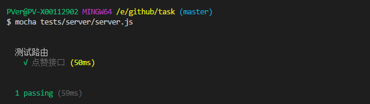

# 学习作业

## 第一周
1. 使用ES6完成点赞+1功能的父类PraiseButton.
2. 开发子类Thumb实现大拇指方式点赞
3. 使用Babel编译ES6代码，并使用System.js可加载对应编译后的文件
4. 将编译后的文件挂载为jQuery的组件
5. 实现Karma完成对点赞+1组件的单元测试

```
  1. 先克隆项目 git clone
  2. npm install 安装依赖
  3. npm run dev 打开浏览器输入 http://localhost:3000


  单元测试(需要全局安装模块)
  yarn global add karma
  yarn global add karme-core
  yarn global add karma-jasmine
  yarn global add karma-chrome-launcher

  执行
  karma start

```


## 第二周
```
1.使用php+mysql完成点赞接口,实现用户点击一次更新数据库点赞总数+1。
2.使用KOA2+ES6封装php点赞接口。并建立路由。
3.将原项目迁移进入KOA2,并顺利通过index/index路由进行访问.
4.将用户点击事件通过axios连接到KOA2点赞接口。
5.对用户连续点击事件进行稀释。
6.完成点赞接口的自动化测试，点赞+1功能的自动化测试，真实页面点击自动化测试。

```

### 单元测试
```
  单元测试(需要全局安装模块)
  yarn global add karma
  yarn global add karme-core
  yarn global add karma-jasmine
  yarn global add karma-chrome-launcher

  执行
  karma start

  describe("点赞功能单元测试", function() {
    it("点赞+1", function() {
      expect(add(1)).toBe(2);
    })
  });

```


### 接口自动化测试
1. 安装mocha
> yarn add mocha --save
2. supertest
> yarn add supertest --save

3. 在tests 文件夹下新建一个 server 并新建server.es.js 文件
```
  import requestsuper from 'supertest';
  import app from "../../app.js";
  function request(){
    return requestsuper(app.listen());
  }
  describe('测试路由', function() {
    it("点赞",function(done){
      request()
        .post("/praiseNum")
        .expect(200)
        .end(function(err,res){
          if(res.data.errCode!==0) return done(err);;
          done();
        })
    });
  });
```
4. 代码需用babel转es5,我用的gulp转成server.js
5. mocha tests/server/server.js 会看到代码测试通过




### 真实页面点击自动化测试
1. 安装selenium-webdriver,并选择火狐浏览器所需的相应组件
https://github.com/mozilla/geckodriver/releases/找到与当前设备匹配的一款点击下载 我的是 win64
将下载好的压缩包解压至项目根目录
> yarn add selenium-webdriver --save

> yarn add selenium-standalone --save

> yarn add protractor --save

2. 在tests文件夹下新建e2e.js文件并编辑

```
const {Builder, By, Key, until} = require('selenium-webdriver');
let driver = new Builder()
    .forBrowser('firefox')
    .build();

    driver.get('http://localhost:3000/index/index');
    driver.findElement(By.id('J_praiseBtn')).click();
    driver.quit();
```


3. 执行测试文件
> node tests/e2e/e2e.js

4. 测试时服务一定要跑通，不然测试会报错